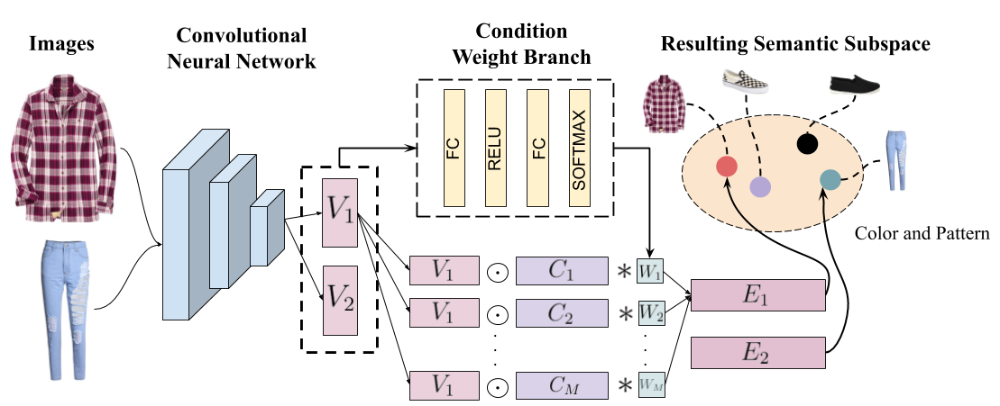

# Learning-Similarity-Conditions

This repository contains a PyTorch implementation of the paper [Learning Similarity Conditions Without Explicit Supervision](https://arxiv.org/abs/1908.08589) accepted at ICCV 2019. It is based on the [official implementation](https://github.com/andreasveit/conditional-similarity-networks) of the [Conditional Similarity Networks](https://arxiv.org/abs/1603.07810) paper. If you find this implementation or the paper helpful, please consider citing:

    @InProceedings{tanSimilarity2019,
    author={Reuben Tan and Mariya I. Vasileva and Kate Saenko and Bryan A. Plummer},
    title={Learning Similarity Conditions Without Explicit Supervision},
    booktitle={ICCV},
    year={2019} }
    
# Dependencies

1. Python 2.7
2. Pytorch version 0.1.12
   
# Download Data
To download the Zappos dataset as well as the training, validation and test triplets:
`python get_data.py`

# Usage
To train the network with the hyperparameter setttings used in the paper,

`python main.py --name {your experiment name} --learned --num_traintriplets 200000`

When training is done, run the following script to evaluate the trained model on the test set:

`python main.py --test --resume runs/{your experiment name}/model_best.pth.tar`

We trained our model on a single GTX 1080 GPU on a CentOS system.

# Contact
Please do not hesitate to contact me at rxtan@bu.edu if you have any questions or problems running the code.
